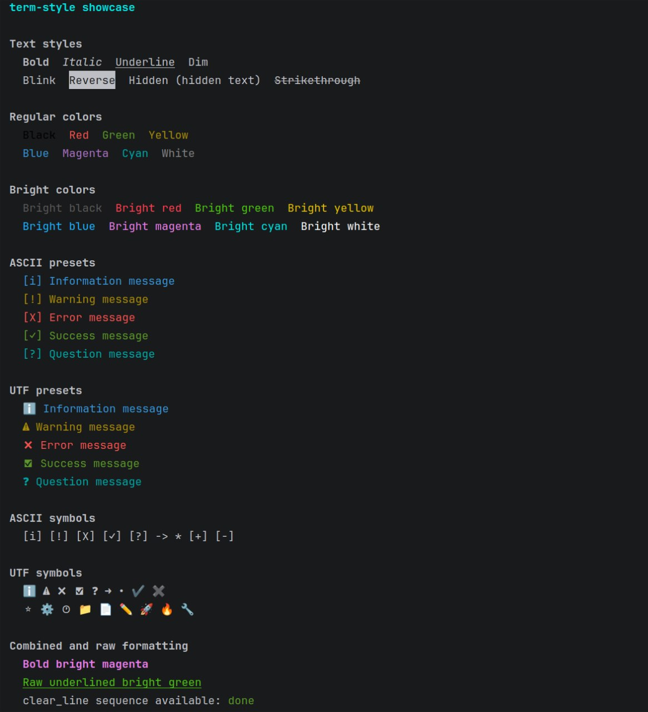

# term-style



`term-style` is a lightweight, header-only C++17 library for styling terminal
output with ANSI escape sequences. It provides colors, text styles, reusable
ASCII and UTF symbols, and ready-to-use status message presets.

The library has no external dependencies and consists of a single header file.

## Features

- Regular and bright terminal colors
- Bold, italic, underline, dim, blink, reverse, hidden, and strikethrough styles
- ASCII and UTF symbols for command-line interfaces
- Ready-made info, warning, error, success, and question messages
- Direct access to raw ANSI escape sequences
- Automatic style reset after formatted text
- Header-only and dependency-free

## Requirements

- A C++17-compatible compiler
- A terminal with ANSI escape sequence support
- UTF-8 terminal support when using `ts::smb::utf` or UTF presets

Most modern Linux and macOS terminals support ANSI sequences by default.
Modern Windows terminals usually support them as well, although behavior may
depend on the terminal and its configuration.

## Quick start

Copy `term-style.h` into your project and include it in your source file:

```cpp
#include <iostream>
#include "term-style.h"

int main()
{
    std::cout << ts::red("Error!") << '\n';
    std::cout << ts::bold("Important:") << " read this message" << '\n';
    std::cout << ts::preset::ascii::success("Build completed") << '\n';
    std::cout << ts::preset::utf::warn("Configuration is missing") << '\n';
}
```

Formatting functions and presets return `std::string`, so their results can be
printed, stored, or combined with other strings.

## Text styles

```cpp
ts::bold("text");
ts::italic("text");
ts::underline("text");
ts::dim("text");
ts::blink("text");
ts::reverse("text");
ts::hidden("text");
ts::strike("text");
```

## Colors

Regular colors:

```cpp
ts::black("text");
ts::red("text");
ts::green("text");
ts::yellow("text");
ts::blue("text");
ts::magenta("text");
ts::cyan("text");
ts::white("text");
```

Bright colors:

```cpp
ts::bright_black("text");
ts::bright_red("text");
ts::bright_green("text");
ts::bright_yellow("text");
ts::bright_blue("text");
ts::bright_magenta("text");
ts::bright_cyan("text");
ts::bright_white("text");
```

Styles and colors can be nested:

```cpp
std::cout << ts::bold(ts::yellow("Warning!")) << '\n';
```

## Message presets

Presets add an appropriate symbol and color to a message. ASCII presets work in
terminals without UTF-8 support:

```cpp
std::cout << ts::preset::ascii::info("Loading configuration") << '\n';
std::cout << ts::preset::ascii::warn("Using default settings") << '\n';
std::cout << ts::preset::ascii::error("Unable to open the file") << '\n';
std::cout << ts::preset::ascii::success("Operation completed") << '\n';
std::cout << ts::preset::ascii::question("Continue?") << '\n';
```

UTF presets provide Unicode symbols for terminals configured to use UTF-8:

```cpp
std::cout << ts::preset::utf::info("Loading configuration") << '\n';
std::cout << ts::preset::utf::warn("Using default settings") << '\n';
std::cout << ts::preset::utf::error("Unable to open the file") << '\n';
std::cout << ts::preset::utf::success("Operation completed") << '\n';
std::cout << ts::preset::utf::question("Continue?") << '\n';
```

Preset colors are blue for information, yellow for warnings, red for errors,
green for success messages, and cyan for questions.

## Symbols

Symbols can also be used independently of the presets.

The `ts::smb::ascii` namespace contains:

```cpp
info, warn, error, success, question, arrow, bullet, check, cross
```

The `ts::smb::utf` namespace contains:

```cpp
info, warn, error, success, question, arrow, bullet, check, cross,
star, gear, clock, folder, file, pencil, rocket, fire, wrench
```

Example:

```cpp
std::cout << ts::smb::utf::rocket << " Starting application...\n";
std::cout << ts::green(ts::smb::ascii::check) << " Tests passed\n";
```

All symbols are `constexpr std::string_view` values.

## Raw ANSI sequences

Use constants from `ts::raw` when you need direct control over where formatting
begins and ends:

```cpp
std::cout << ts::raw::blue
          << ts::raw::underline
          << "Blue underlined text"
          << ts::raw::reset
          << '\n';
```

Terminal control sequences are available as well:

```cpp
std::cout << ts::raw::clear;      // Clear the terminal screen
std::cout << ts::raw::clear_line; // Clear from the cursor to the end of the line
```

Always output `ts::raw::reset` after using raw formatting to prevent it from
affecting subsequent terminal output.

## Installation with CMake FetchContent

The library is header-only, so it only needs to be downloaded and added to your
target's include directories:

```cmake
cmake_minimum_required(VERSION 3.14)
project(my_app LANGUAGES CXX)

include(FetchContent)

FetchContent_Declare(
    term_style
    GIT_REPOSITORY "https://github.com/ra1zzzengpt/term-style.git"
    GIT_TAG v1.0
)

FetchContent_GetProperties(term_style)
if(NOT term_style_POPULATED)
    FetchContent_Populate(term_style)
endif()

add_executable(my_app main.cpp)
target_compile_features(my_app PRIVATE cxx_std_17)
target_include_directories(my_app PRIVATE "${term_style_SOURCE_DIR}")
```

Then include the header normally:

```cpp
#include "term-style.h"
```

For reproducible builds, use a specific release tag or commit hash as
`GIT_TAG`.

## Notes

- Formatting functions reset all active styles at the end of their text.
- Some terminals do not support `blink` or `hidden`.
- Unicode symbols may render differently depending on the terminal font.
- ANSI escape sequences remain in the output when it is redirected to a file.
